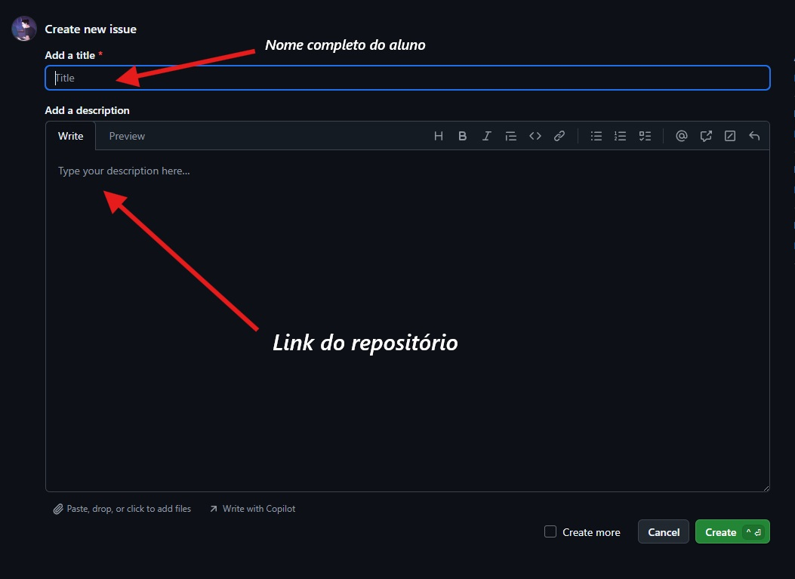

# 🚀 Projeto Front-End – Consumo de API com JavaScript

## Nome: Robson Cassiano

Este projeto foi desenvolvido como parte da disciplina de **Programação de Sítios Internet** - FATEC.
Este projeto faz parte da disciplina de **Programação de Sítios Internet** - FATEC.

## 🎯 Objetivo

Você deve criar uma aplicação web utilizando **JavaScript puro (Vanilla JS)** para consumir dados de uma **API pública**, exibindo os resultados de forma dinâmica em uma interface amigável.

## 💡 O que você deve implementar

- Crie um **campo de busca** para o usuário digitar o termo desejado
- Consuma uma **API pública** utilizando `fetch()`
- Exiba os resultados da busca em formato de **cards criados dinamicamente**
- Utilize **métodos de manipulação do DOM** para criar os elementos HTML
- Implemente **tratamento de erros** no campo de busca (ex: campo vazio, resultado não encontrado)
- Garanta que a interface esteja **responsiva**

## 🌐 Sugestão de APIs públicas

- 🦸 **SuperHero API** – [https://superheroapi.com](https://superheroapi.com)
- 🎬 **OMDb API** (filmes) – [https://www.omdbapi.com](https://www.omdbapi.com)
- 🖼️ **Pixabay API** (imagens) – [https://pixabay.com/api/docs](https://pixabay.com/api/docs)

- 💻 GitHub: (https://github.com/RobsonCassiano)
- 🌐 GitHub Pages: (https://robsoncassiano.github.io/p1-Programa-o-de-S-tios-Internet-FATEC-2026/)

## 📦 Entrega

### Como entregar

Você deve criar uma **issue** neste repositório com as informações do seu projeto, seguindo o modelo abaixo:

### Prazos

| Data | Condição |
|------|----------|
| **17/04/2026** | Entrega em sala de aula — o professor poderá verificar e orientar correções |
| **22/04/2026** | Entrega somente pela issue — sem verificação prévia |

> ⚠️ Após o prazo final (22/04), nenhuma entrega será aceita.

### README do seu projeto

Utilize o [modelo de README](./readmeAluno.md) como base para documentar o seu repositório.

👉 [www.linkedin.com/in/robson-cassiano-b6a44195]

---
Critérios

Foi criado o campo de busca? (0,5)
Inserido searchInput e searchBtn que está capturando o evento de submit do formulário.

Os cards são criados dinamicamente? (1,5)
Criei uma função CardComponent e cloneNode, para o site ficar dinâmico.

Os cards são criados dependendo da busca? (1,5)
O fetchCharacters(currentName, currentPage) utiliza o valor capturado no input para filtrar os resultados da API. Adicionei 3 botoes de sugestão para ficar intuitivo para o usuário.

Foi utilizado métodos para criar os novos elementos HTML? (1,5) 
Utilizado template.content.cloneNode(true) para a estrutura e container.appendChild(card) para inserir no DOM (container.replaceChildren() para limpar a lista).

O consumo de API foi feito usando o fetch()? (1,5)
O código utiliza await fetch(...) assíncrona.

Incluiu tratamento de erro no campo de busca? (0,5)
Implementado um bloco try catch para verificar se a resposta é res.ok e trata o caso de "Nenhum resultado" quando a lista volta vazia.

Está responsivo? (1,0)
Nao tive aula relacionada a responsividade portanto nao posso confirmar.

Foi criado o README com informações do projeto? (1,0)

Projeto montado conforme informacoes do README.md, Fonte utilizada:waltograph.regular. Link da API:(https://disneyapi.dev/) / https://disneyapi.dev/docs/

Foi habilitado o github Pages? (0,5)
O link está no README.

Foi publicado no linkedIn? (0,5)
Sim - https://www.linkedin.com/in/robson-cassiano-b6a44195
 ---
## ✅ Critérios de Avaliação
* [ ] Você criou o campo de busca? (0,5)
* [ ] Os cards são criados dinamicamente? (1,5)
* [ ] Os cards são criados dependendo da busca? (1,5)
* [ ] Você utilizou métodos para criar os novos elementos HTML? (1,5)
* [ ] O consumo de API foi feito usando o `fetch()`? (1,5)
* [ ] Você incluiu tratamento de erro no campo de busca? (0,5)
* [ ] Está responsivo? (1,0)
* [ ] Você criou o README com informações do projeto? (1,0)
* [ ] Você habilitou o GitHub Pages? (0,5)
* [ ] Você publicou no LinkedIn? (0,5)

## 👨‍🏫 Disciplina

**Programação de Sítios Internet**  
Prof. Fernando Leonid – 2026

---
